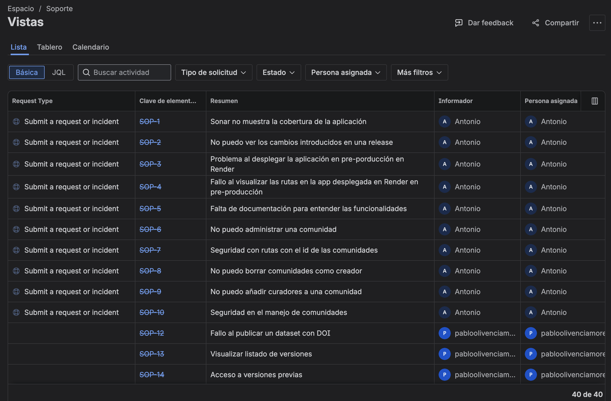
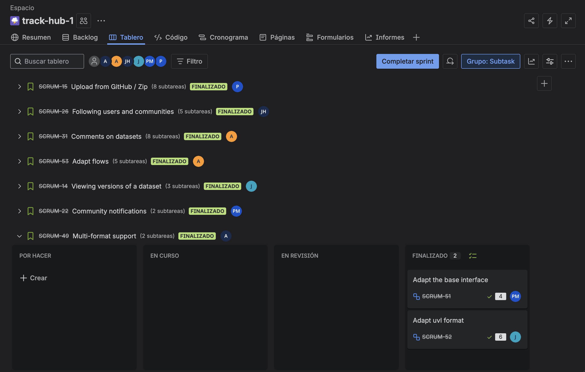

# Documento del Proyecto

## Portada

### Nombre del proyecto
**TRACK-HUB-1**

### Grupo
**Grupo 3 tarde**

### Curso escolar
**2025/2026**

### Asignatura
**Evolución y Gestión de la Configuración**

---

### Miembros del equipo

| Miembro | Implicación (1–10) |
|-------|--------------------|
| Castrillón Mora, Pablo | 9 |
| Hu, Jianwu | 9 |
| Olivencia Moreno, Pablo | 9.5 |
| Ramírez Gil, Adrián | 9 |
| Rodríguez Calderón, Antonio | 10 |
| Varo Vera, Juan | 7 |


---

### Enlaces de interés
- **Enlace de Jira tareas:** [https://egc-track-hub.atlassian.net/jira/software/projects/SCRUM/boards/1]
- **Enlace tablero Soporte:** [https://egc-track-hub.atlassian.net/jira/servicedesk/projects/SOP/boards/34]
- **Repositorio de código:** [https://github.com/track-hub-team/track-hub-1]
- **Sistema desplegado en Render producción:** [https://track-hub-1.onrender.com]
- **Sistema desplegado en Render preproducción:** [https://track-hub-1-staging.onrender.com]
- **Sistema desplegado en Server propio preproducción:** [https://pre-trackhub.pabolimor.cloud/]
- **Sistema desplegado en Server propio producción:** [https://trackhub.pabolimor.cloud/]
- **Documentación principal:** [https://github.com/track-hub-team/track-hub-1/blob/trunk/README.md]
- **Enlace de Fakenodo desplegado en servidor propio:** [https://fakenodo.pabolimor.cloud/health]
- **Repositorio con archivos de ejemplo:** [https://github.com/pcm290/testgithubrepositorytrackhub]
---
## Indicadores del proyecto

> Se aportan enlaces a evidencias (issues, commits, gráficas, PRs, Sonar, etc.) que permiten analizar los indicadores.

| Miembro | Horas | Commits | LoC | Test | Issues | Work Item | Dificultad |
|--------|------:|--------:|----:|-----:|-------:|-----------|-----------|
| Rodríguez Calderón, Antonio | 71 | 96 | ≈9001 | 11 | 16 | [#74](https://github.com/EGCETSII/uvlhub/issues/74) | L |
| Olivencia Moreno, Pablo | 62 | 26 | 3758 | 27 | 6 | [#70](https://github.com/EGCETSII/uvlhub/issues/70) | H |
| Castrillón Mora, Pablo | 52:18 | 15 | 5885 | 23 | 14 | [#80](https://github.com/EGCETSII/uvlhub/issues/80) | M |
| Hu, Jianwu | 51:58 | 24 | 2594 | 30 | 11 | [#92](https://github.com/EGCETSII/uvlhub/issues/92) | M |
| Ramírez Gil, Adrián | 59:31 | 19 | 6419 | 16 | 7 | [#101](https://github.com/EGCETSII/uvlhub/issues/101) | L |
| Varo Vera, Juan | 52:04 | 13 | 1378 | 18 | 6 | [#86](https://github.com/EGCETSII/uvlhub/issues/86)| M |
| **TOTAL** | **348:51** | **185** | **≈26,537** | **125** | **67** | - | **H (1) / M (3) / L (2)** |


**Criterios:**
- **Horas:** horas reales empleadas.
- **Commits:** solo commits del equipo.
- **LoC:** líneas creadas/modificadas por el equipo (sin terceros).
- **Test:** tests nuevos del equipo.
- **Issues:** issues gestionadas por el equipo.
- **Work Item:** principal WI asumido.
- **Dificultad:** Alta / Media / Baja.

**Evidencias:**
- Commits/PRs: Ver "Integración con otros equipos."
- Métricas/Gráficas: Ver [enlace]


*Figura 1: Tablero Jira mostrando las issues gestionadas durante el proyecto*


*Figura 2: Vista de tareas y work items en Jira durante el Sprint 1 (incluye también de Sprint 0)*

**Nota cálculo de LoC (Antonio Rodríguez):**

El valor de 9001 líneas de código es aproximado. No se sabe a ciencia cierta las líneas cubiertas ya que ha sido el autor del commit inicial y la persona que ha subido datos de ejemplo del seeder. No obstante se ha intendado estimar como sigue:

```bash
git log --author="PDJ6975" 4d8f5cec..HEAD --pretty=tformat: --numstat | grep -v '\.gpx$' | grep -v '\.svg$' | awk '{add+=$1;
       del+=$2} END {print "Añadidas:", add; print "Eliminadas:", del}'
```

Con este comando obtenemos la siguiente salida:
- **Añadidas**: 9001 líneas de código
- **Eliminadas**: 3039

---

## Integración con otros equipos

- **Track-hub-2:** Se realizó integración colaborativa para compartir funcionalidades comunes y evitar duplicación de esfuerzos. Las características integradas incluyen la adaptación del formato GPX (desarrollado originalmente por Track-hub-2) y el flujo de despliegue continuo (CD) a Render.

  **Evidencias:**
  - [Documento de integración detallado](track-hub-2-integration.md)
  - [PR #4 - GPX Format Adaptation](https://github.com/track-hub-team/track-hub-1/pull/4)
  - [PR #3 - CD Workflow Integration](https://github.com/track-hub-team/track-hub-1/pull/3)

---

## Resumen Ejecutivo del Proyecto Track-hub-1

El proyecto **Track-hub-1**, desarrollado por el **Grupo 3** durante el curso escolar **2025/2026**, abordó la implementación de funcionalidades avanzadas y la mejora de la infraestructura de calidad dentro de la plataforma **UVLHub**, en el marco de la asignatura **Evolución y Gestión de la Configuración**.

Catalogado como un proyecto de tipo **UVLHub-equipo**, el trabajo requirió una intensa coordinación con otros equipos para lograr la integración continua de código y flujos de despliegue. El esfuerzo total estimado para el proyecto fue de **160 horas**.

---

## Calidad y Flujo de Desarrollo (CI por Antonio)

La gestión del código se basó en el **EGC Flow**, una variante adaptada de **Git Flow**, que establece ramas específicas para:

- **Producción:** `main`
- **Integración:** `trunk`
- **Nuevas funcionalidades:** `feature/<task>`
- **Correcciones:** `bugfix/<task>`, `hotfix/<task>`

Se exige que todos los commits sigan la especificación de **Conventional Commits** e incluyan una referencia al identificador de la tarea de Jira (`Refs: SCRUM-XX`).

La robustez del desarrollo fue asegurada mediante una completa infraestructura de **Integración Continua y Despliegue Continuo (CI/CD)**.
**Antonio Rodríguez Calderón** fue responsable de esta implementación, que opera mediante:

- **Validación local:** pre-commit hooks
- **Validación remota:** GitHub Actions

### Etapas de la pipeline de CI

1. **Validación de Commits y Ramas**
   Verificación de mensajes según *Conventional Commits* y nombres de rama conforme a *EGC Flow*.

2. **Calidad del Código**
   - Formateo automático con **Black** e **isort**
   - Análisis estático con **Flake8**

3. **Pruebas Automatizadas**
   - Ejecución de tests con **pytest**
   - Cobertura mínima del **50%** en ramas `trunk` y `main`

4. **Seguridad**
   - Escaneo de dependencias con **pip-audit**
   - Análisis estático de seguridad con **Bandit**
   - Detección de secretos con **TruffleHog**

### Despliegue

El despliegue se organizó en **Render**, manteniendo:

- **Staging:** sincronizado con `trunk`
- **Producción:** desplegado tras la creación de un *Release* en `main`

Dado el carácter efímero del sistema de archivos de Render, la persistencia de archivos subidos se gestiona mediante la sincronización con un **repositorio dedicado de GitHub**.

---

## Work Items (WIs) Implementados y Atribuciones

Se implementaron funcionalidades clave enfocadas en la curación, la publicación académica y la usabilidad de la plataforma.

### 1. Sistema de Versionado de Datasets (WI #86, Dificultad Alta)

Este sistema permite a los usuarios comprender la evolución de un dataset, diferenciando entre:

- **Versiones Mayores (MAJOR):**
  Se crean cuando hay cambios en los archivos y generan un nuevo **DOI específico de versión**.

- **Versiones Menores / Parche (MINOR / PATCH):**
  Aplicadas a mejoras o correcciones de metadatos (título, descripción) sin cambios en los archivos, manteniendo el **DOI conceptual**.

Para garantizar la reproducibilidad y la trazabilidad de las citas, se distingue entre:

- **DOI Conceptual:** siempre apunta a la última versión publicada.
- **DOI Específico de Versión:** vinculado permanentemente a los archivos de esa edición.

---

### 2. Implementación de Fakenodo (WI Obligatorio por Adrián)

La lógica de versionado se apoya en la integración con un servicio mock de Zenodo.
**Adrián Ramírez Gil** implementó el Work Item de **Fakenodo**, un microservicio **Flask** que simula la API de Zenodo.

Fakenodo es fundamental porque:

- Replica el sistema de versionado inteligente de Zenodo.
- Detecta cambios en archivos para asignar un nuevo DOI o mantener el anterior.
- Permite el desarrollo sin depender de la red.
- Evita consumir la cuota real de Zenodo.

---

### 3. Gestión y Notificaciones de Comunidades (WIs #74 y #80)

- **WI #74 (Dificultad Low):**
  Introduce el módulo de **Comunidades**, espacios temáticos o institucionales para agrupar datasets.
  - Cualquier usuario autenticado puede crear una comunidad.
  - El creador se convierte en el primer **curador**.
  - Los curadores revisan y aprueban propuestas de datasets.

- **WI #80 (Dificultad Medium):**
  Implementa notificaciones por **correo electrónico** cuando un dataset es aceptado en una comunidad.

---

### 4. Subida de Archivos ZIP/GitHub (WI #70, Dificultad Alta)

Se implementó la funcionalidad para subir colecciones de archivos **GPX** o **UVL** empaquetados en formato ZIP.

El sistema:

- Realiza una **extracción segura**.
- Valida y filtra los archivos permitidos (`.uvl`, `.gpx`).
- Incorpora protecciones críticas contra ataques de **Path Traversal**.

---

### 5. Sistema de Comentarios (WI #101, Dificultad Baja)

Se añadió un sistema de **Comentarios** en los datasets para permitir feedback de los usuarios.

Características:

- El propietario del dataset actúa como **moderador**.
- Puede eliminar cualquier comentario.
- Los autores pueden **editar o eliminar solo sus propios comentarios**.

---

## Integración y Conclusión

El proyecto incorporó integraciones esenciales del equipo **Track Hub 2**, logrando:

- Adaptación del **Formato GPX**.
- Integración del flujo de **Despliegue Continuo (CD)** a Render.

En resumen, **Track-hub-1** ha entregado una plataforma funcional que combina:

- Una base sólida de **ingeniería de software** (CI/CD robusto, EGC Flow).
- Funcionalidades avanzadas de **publicación académica y curación de datos**
  (Versionado con DOIs, Comunidades y Fakenodo).

El proyecto abordó y completó múltiples Work Items de diversas dificultades, demostrando la capacidad del equipo para gestionar tanto tareas complejas de alto nivel como integraciones avanzadas, resultando en una solución **completa, robusta y testeable**.

---
## Descripción del sistema de Track-Hub
## Visión General Funcional

**Track-Hub** es una aplicación web basada en **Flask** orientada a la gestión y publicación de rutas GPS y datasets. El sistema permite a los usuarios cargar, explorar y gestionar archivos **GPX** (GPS Exchange Format) y **modelos de características** (*feature models*), facilitando la colaboración y el intercambio de datos geoespaciales.

---

## Arquitectura del Sistema

### Estructura Modular

La aplicación sigue una arquitectura modular basada en **Flask Blueprints**, organizada en el directorio `modules`. Cada módulo implementa el patrón **MVC (Modelo–Vista–Controlador)** con componentes adicionales:

- **Models**: Definición de entidades de base de datos
- **Routes**: Endpoints y controladores de peticiones HTTP
- **Services**: Lógica de negocio
- **Repositories**: Capa de acceso a datos
- **Forms**: Validación de formularios con WTForms
- **Templates**: Vistas HTML con Jinja2
- **Tests**: Suite de pruebas unitarias y de integración

### Framework Core

El directorio `core` proporciona la infraestructura base del sistema:

- **blueprints/**: Clase base para blueprints (`base_blueprint.py`)
- **repositories/**: Repositorio base (`BaseRepository.py`)
- **services/**: Servicio base (`BaseService.py`)
- **seeders/**: Sistema de población de datos (`BaseSeeder.py`)
- **managers/**: Gestión de configuración, logging, errores y módulos
- **configuration/**: Sistema de configuración centralizado
- **decorators/**: Decoradores personalizados
- **serialisers/**: Serialización de objetos
- **locust/**: Utilidades para pruebas de carga
- **selenium/**: Herramientas para pruebas automatizadas

---

## Módulos Funcionales

### Módulo Auth (Autenticación)

Gestiona el registro, inicio de sesión y autenticación de usuarios. Incluye:

- Formularios de login y registro (`forms.py`)
- Modelos de usuario (`models.py`)
- Servicios de autenticación y autorización (`services.py`)
- Endpoints para login, logout y registro (`routes.py`)
- Seeder para datos iniciales de usuarios (`seeders.py`)

---

### Módulo Dataset

Módulo principal para la gestión de datasets de rutas GPS:

- **API REST** (`api.py`): Endpoints CRUD sobre datasets
- **Modelos** (`models.py`): Entidades de datasets, metadatos y archivos
- **Registry** (`registry.py`): Sistema de registro de datasets
- **Handlers**: Procesadores especializados por tipo de archivo
- **Fetchers**: Componentes para obtención de datos externos
- **Ejemplos GPX** (`gpx_examples/`)
- **Ejemplos UVL** (`uvl_examples/`)
- **Test Data** (`test_data/`)

---

### Módulo Community

Gestiona la funcionalidad comunitaria y colaborativa:

- Interacción entre usuarios
- Gestión de comunidades de datasets
- Intercambio y descubrimiento de rutas

Componentes estándar:
- Models, forms, routes, services y repositories
- Templates específicos para vistas comunitarias

---

### Módulo Explore

Proporciona capacidades de búsqueda y exploración:

- Formularios de búsqueda avanzada (`forms.py`)
- Servicios de búsqueda y filtrado (`services.py`)
- Interfaz de exploración de datasets (`templates/`)
- Repositorios especializados para consultas de exploración

---

### Módulo FeatureModel

Gestiona modelos de características (*feature models*):

- Modelos de datos (`models.py`)
- Servicios de procesamiento de archivos **UVL**
- Integración con datasets
- Visualización y edición de modelos de características

---

### Módulo Fakenodo

Simulador de **Zenodo** para desarrollo y testing:

- Aplicación Flask independiente (`app.py`)
- Emulación de la API de Zenodo
- Pruebas sin dependencia del servicio real
- Suite de tests específica (`tests/`)

---

### Módulo Mail

Sistema de notificaciones por correo electrónico:

- Servicios de envío de emails (`services.py`)
- Rutas para gestión de notificaciones (`routes.py`)
- Integración con eventos del sistema

---

## Módulos Complementarios

### Módulo Hubfile
Gestión de archivos del hub, incluyendo almacenamiento y recuperación de archivos asociados a datasets.

### Módulo Profile
Gestión de perfiles de usuario, configuración personal y preferencias.

### Módulo Public
Páginas públicas y contenido accesible sin autenticación.

### Módulo Team
Gestión de equipos y colaboración grupal.

### Módulo Webhook
Sistema de webhooks para integraciones externas.

### Módulo Zenodo
Integración con Zenodo para publicación de datasets:

- Configuración mediante `.env.example`
- Modelos para sincronización con Zenodo
- Servicios de publicación y actualización

### Módulo Flamapy
Integración con la librería **Flamapy** para análisis de modelos de características.

---

## Sistema de CI/CD

### Integración Continua (CI)

Workflows definidos en `workflows/`:

- **CI_commits.yml**: Validación de mensajes de commit
- **CI_gate.yml**: Gate de calidad general
- **CI_lint.yml**: Análisis de código estático
- **CI_pytest.yml**: Ejecución de tests
- **CI_security.yml**: Análisis de seguridad
- **CI_sonar.yml**: Integración con SonarQube

### Despliegue Continuo (CD)

- **CD_dockerhub_production.yml**: Publicación en DockerHub (producción)
- **CD_dockerhub_staging.yml**: Publicación en DockerHub (staging)
- **CD_render_production.yml**: Despliegue en Render (producción)
- **CD_render_staging.yml**: Despliegue en Render (staging)
- **CD_selfhosted.yml**: Despliegue en infraestructura propia

### Workflows de Build

- **build_main.yml**: Construcción desde `main`
- **build_trunk.yml**: Construcción desde `trunk`
- **release.yml**: Gestión de releases

---

## Git Hooks

El directorio `.git-hooks` contiene:

- **prepare-commit-msg**: Hook para formateo automático de mensajes de commit

---

## Recursos Estáticos

Directorio `static/`:

- **css/**: Hojas de estilo
- **js/**: Scripts JavaScript
- **img/**: Imágenes
- **fonts/**: Fuentes personalizadas
- **gifs/**: Animaciones

---

## Templates Base

- **base_template.html**: Plantilla base con layout común
- **400.html**, **401.html**, **404.html**, **500.html**: Páginas de error personalizadas

---

## Características Técnicas

- **Framework**: Flask con arquitectura modular
- **ORM**: SQLAlchemy (implícito por el uso de repositories)
- **Testing**: Pytest (configuración en `pytest.ini`)
- **Formularios**: WTForms
- **Seeders**: Sistema de población de datos inicial
- **Configuración centralizada**: Core configuration manager
- **Logging**: Sistema de logging unificado
- **Manejo de errores**: Error handler manager centralizado

Este sistema está diseñado específicamente para la **gestión de rutas GPS en formato GPX**, con soporte para **modelos de características UVL** e integración con repositorios científicos como **Zenodo**.

## Visión Global del Proceso de Desarrollo

## Introducción al Proceso

El desarrollo de **Track-Hub-1** se rige por un proceso altamente estructurado que combina metodologías ágiles con prácticas rigurosas de ingeniería de software. El flujo de trabajo está diseñado para garantizar calidad, trazabilidad y control desde la concepción de un cambio hasta su despliegue en producción.

---

## Herramientas del Ecosistema de Desarrollo

### Gestión de Proyecto

- **Jira**: Plataforma central para la gestión de tareas, historias de usuario y seguimiento de incidencias. Se utiliza un espacio dedicado de soporte para la gestión de incidentes.
- **Clockify**: Sistema integrado de seguimiento temporal que permite registrar las horas dedicadas a cada tarea, proporcionando métricas precisas del esfuerzo invertido.

### Control de Versiones

- **Git**: Sistema de control de versiones distribuido que implementa el flujo **EGC Flow**.
- **GitHub**: Repositorio remoto que almacena el código y ejecuta las pipelines de CI/CD mediante GitHub Actions.

### Calidad y Testing

- **Pre-commit hooks**: Validaciones locales ejecutadas antes de confirmar cambios.
- **Black**: Formateador automático de código Python (120 caracteres por línea).
- **isort**: Organizador de importaciones compatible con Black.
- **Flake8**: Linter para validación PEP8 (ignora `E203`, `W503`).
- **mypy**: Verificador de tipos estático.
- **pytest**: Framework de pruebas con requisito de cobertura mínima del 50% en ramas `trunk` y `main`.
- **Codecov**: Plataforma para seguimiento de cobertura de código.

### Seguridad

- **pip-audit**: Escaneo de vulnerabilidades en dependencias.
- **Bandit**: Análisis estático de seguridad del código.
- **TruffleHog**: Detección de secretos y credenciales en el código.

### Despliegue

- **Render**: Plataforma de despliegue para entornos staging y producción.
- **Servidor propio**: Infraestructura adicional para pre-producción y producción en `pabolimor.cloud`.
- **Docker**: Contenedorización de la aplicación.
- **DockerHub**: Registro de imágenes Docker.

---

## Flujo de Trabajo: EGC Flow

El proyecto implementa **EGC Flow**, una adaptación de Git Flow que establece una estructura clara de ramas:

### Ramas Principales

- **`main`**: Rama de producción. Solo recibe código validado y estable.
- **`trunk`**: Rama de integración donde converge todo el desarrollo antes de pasar a producción.

### Ramas de Desarrollo

- **`feature/<task>`**: Para nuevas funcionalidades (ej: `feature/SCRUM-74-community-module`).
- **`bugfix/<task>`**: Para correcciones de errores detectados en desarrollo (ej: `bugfix/SCRUM-XX-fix-repository-links`).
- **`hotfix/<task>`**: Para correcciones urgentes en producción.

Todas las ramas deben incluir el identificador de la tarea de Jira correspondiente.

---

## Estándares de Commits

Cada commit debe seguir la especificación de **Conventional Commits**:

```

<type>(<scope>): <subject>

[optional body]

Refs: SCRUM-XX

```

### Tipos de Commit

- **feat**: Nueva funcionalidad
- **fix**: Corrección de error
- **docs**: Cambios en documentación
- **style**: Cambios de formato (no afectan lógica)
- **refactor**: Refactorización de código
- **test**: Adición o modificación de tests
- **chore**: Tareas de mantenimiento

La referencia a Jira (`Refs: SCRUM-XX`) se añade automáticamente mediante el hook `prepare-commit-msg` basándose en el nombre de la rama activa.

---

## Ejemplo Práctico: Ciclo Completo de un Cambio

Para ilustrar el proceso completo, se presenta el flujo de trabajo para corregir un error en los enlaces del repositorio en las plantillas HTML.

### Contexto del Cambio

**Problema identificado**: Los enlaces en el footer de la aplicación apuntan al repositorio original (`https://github.com/diverso-lab/uvlhub`) en lugar del repositorio del equipo (`https://github.com/track-hub-team/track-hub-1`).

**Impacto**: Los usuarios que hacen clic en "Repository on GitHub" son redirigidos al proyecto incorrecto.

---

### Paso 1: Creación del Incidente (Jianwu)

Un miembro del equipo detecta el problema y crea un incidente en el **espacio de soporte de Jira** siguiendo la plantilla establecida:

```markdown

1. Pasos para reproducir:
- Navegar a cualquier página de la aplicación
- Desplazarse al footer
- Hacer clic en "Repository on GitHub"

2. Resultado esperado:

- Debe dirigir a https://github.com/track-hub-team/track-hub-1

3. Resultado actual:

- Redirige a https://github.com/diverso-lab/uvlhub

4. Entorno:

- Versión: 1.0.0
- Navegador: Chrome 120
- Fecha de detección: 15/12/2025

```

El incidente se asigna a un desarrollador y se establece como prioridad baja.

---

### Paso 2: Triage del Incidente (Jianwu)

Para cumplir con el SLA, se responde al incidente:

```

Procedemos con la revisión del footer.

```

Se actualiza el estado del SLA a "En Curso" y se confirma la prioridad como baja.

---

### Paso 3: Creación de Tarea (Pablo Castrillón)

Se crea una tarea en el backlog de Jira bajo la sección "Todo lo Demás" (ya que no pertenece a ninguna historia de usuario existente):

```

Título: Update repository links in templates

Descripción:

Reemplazar las URLs de diverso-lab/uvlhub con

track-hub-team/track-hub-1 en los archivos de plantillas.

Story Points: 2

Prioridad: Low

```

La tarea se asigna al desarrollador responsable.

---

### Paso 4: Vinculación de Incidente y Tarea (Pablo Castrillón)

Se establece un enlace en Jira entre el incidente de soporte y la tarea de desarrollo, asegurando trazabilidad completa del problema hasta su resolución.

---

### Paso 5: Creación de Rama (Adrián Ramírez)

Desde la interfaz de Jira, utilizando la integración con Git, se crea una rama de tipo bugfix:

```bash

# Jira ejecuta automáticamente:

git checkout trunk

git pull origin trunk

git checkout -b bugfix/SCRUM-XX-update-repository-links

git push -u origin bugfix/SCRUM-XX-update-repository-links

```

Se inicia el seguimiento temporal en Clockify para esta tarea.

---

### Paso 6: Implementación del Cambio (Antonio)

El desarrollador clona el repositorio y descarga la rama:

```bash

git fetch origin

git checkout bugfix/SCRUM-XX-update-repository-links

```

Realiza el cambio en base_template.html:

```html

<!-- Línea 222 - ANTES -->

<a class="text-muted" href="https://github.com/diverso-lab/uvlhub"

<!-- Línea 222 - DESPUÉS -->

<a class="text-muted" href="https://github.com/track-hub-team/track-hub-1"

```

Confirma el cambio:

```bash

git add app/templates/base_template.html

git commit

```

El hook `prepare-commit-msg` proporciona la plantilla de commit, que se completa:

```

fix(templates): update repository links to team repository

Refs: SCRUM-XX

```

Antes de completar el commit, se ejecutan automáticamente los **pre-commit hooks**:

1. Eliminación de espacios en blanco finales ✓
1. Validación de YAML ✓
1. Formateo con Black ✓
1. Ordenación de importaciones con isort ✓
1. Validación con Flake8 ✓
1. Verificación de tipos con mypy ✓

Al hacer push, el **pre-push hook** valida que el nombre de la rama cumple con EGC Flow:

```bash

git push

```

---

### Paso 7: Integración Continua Remota

GitHub Actions ejecuta automáticamente múltiples workflows:

#### CI_commits.yml

Valida que el mensaje del commit cumple con Conventional Commits.

#### CI_lint.yml

Ejecuta las mismas validaciones de calidad que los hooks locales:

- Black
- isort
- Flake8

#### CI_pytest.yml

Ejecuta la suite completa de tests con pytest. Como es una rama `bugfix`, no se requiere cobertura mínima, pero los tests deben pasar.

#### CI_security.yml

Realiza escaneos de seguridad:

- `pip-audit`: Verifica vulnerabilidades en dependencias
- `Bandit`: Analiza el código en busca de problemas de seguridad
- `TruffleHog`: Detecta secretos o credenciales expuestas

#### CI_gate.yml

Actúa como punto de control unificado que verifica que todos los workflows anteriores hayan completado exitosamente.

---

### Paso 8: Revisión de Código (Pablo Olivencia)

El revisor mueve la tarea en Jira a la columna "En Revisión" y verifica:

- Que todos los checks de CI han pasado ✓
- Que el cambio es correcto y cumple con el objetivo ✓
- Que no introduce regresiones ✓

Una vez aprobado, mueve la tarea a "Finalizado".

---

### Paso 9: Merge a Trunk (Pablo Olivencia)

El revisor integra los cambios en la rama `trunk`:

```bash

git checkout trunk

git pull origin trunk

git merge bugfix/SCRUM-XX-update-repository-links

git push

```

Al hacer push a `trunk`, se ejecutan de nuevo todos los workflows de CI, pero esta vez:

- **CI_pytest.yml** requiere cobertura mínima del 50%
- Los resultados de cobertura se envían a **Codecov**

Si todos los checks pasan, se ejecuta **CD_render_staging.yml**, que despliega automáticamente la aplicación en el entorno de staging de Render.

El desarrollador detiene el seguimiento temporal en Clockify.

---

### Paso 10: Validación en Staging

El equipo verifica que el cambio funciona correctamente en el entorno de staging:

```

https://track-hub-1-staging.onrender.com

```

Se confirma que los enlaces del footer ahora apuntan al repositorio correcto.

---

### Paso 11: Cierre del Incidente (Juan)

Una vez validado el cambio en staging, se cierra el incidente original en Jira:

```

Resolution: Listo

El repositorio ahora tiene un href apuntando correctamente

a track-hub-team/track-hub-1

```

El incidente se mueve a "Hecho".

---

### Paso 12: Release a Producción

Cuando se decide crear un release, se ejecuta el workflow **release.yml** que:

1. Crea un tag de versión
1. Genera notas de release automáticas
1. Fusiona `trunk` en `main`
1. Ejecuta **CD_render_production.yml**
1. Despliega en producción:
- Render: `https://track-hub-1.onrender.com`
- Servidor propio: `https://trackhub.pabolimor.cloud`

---

## Despliegue Continuo: Arquitectura de Entornos

### Staging (Pre-producción)

- **Trigger**: Push a rama `trunk`
- **Destinos**:
- Render: `https://track-hub-1-staging.onrender.com`
- Servidor propio: `https://pre-trackhub.pabolimor.cloud`
- **Propósito**: Validación final antes de producción

### Producción

- **Trigger**: Creación de Release desde `main`
- **Destinos**:
- Render: `https://track-hub-1.onrender.com`
- Servidor propio: `https://trackhub.pabolimor.cloud`
- **Docker**: Publicación de imágenes en DockerHub

---

## Gestión de Persistencia

Dado el carácter efímero del filesystem de Render, los archivos subidos se sincronizan con un \*\*repositorio GitHub dedicado\*\* (`https://github.com/pcm290/testgithubrepositorytrackhub`), configurado mediante las variables de entorno:

- `UPLOADS\_GIT\_REPO\_URL`
- `UPLOADS\_GITHUB\_TOKEN`

Esto garantiza que los datos persistan entre despliegues.

---

## Subsistemas Críticos

### Base de Datos

- **MariaDB** alojada en Filess.io
- Configuración mediante variables de entorno:
- `MARIADB\_HOSTNAME`
- `MARIADB\_PORT`
- `MARIADB\_DATABASE`
- `MARIADB\_USER`
- `MARIADB\_PASSWORD`

### Fakenodo

Microservicio independiente que simula la API de Zenodo, esencial para el desarrollo del sistema de versionado:

- Desplegado en: `https://fakenodo.pabolimor.cloud/health`
- Permite desarrollo sin consumir cuota de Zenodo real

---

## Métricas y Seguimiento

El proyecto mantiene métricas exhaustivas:

- **Horas trabajadas**: 348:51 totales (registradas en Clockify)
- **Commits**: 185 del equipo
- **Líneas de código**: ≈26,537 (excluyendo archivos generados)
- **Tests**: 125 nuevos tests
- **Issues gestionadas**: 67 en Jira

Estas métricas se recopilan mediante:

- Jira (issues, story points)
- Clockify (tiempo)
- GitHub (commits, LoC)
- Codecov (cobertura de tests)

---

## Conclusión del Proceso

Este flujo de trabajo garantiza que cada cambio, desde un simple bugfix hasta una funcionalidad compleja, pasa por múltiples capas de validación:

1. **Validación humana**: Revisión en Jira
1. **Validación local**: Pre-commit hooks
1. **Validación remota**: GitHub Actions CI
1. **Validación funcional**: Testing en staging
1. **Aprobación final**: Despliegue a producción

El resultado es un sistema robusto, trazable y de alta calidad que cumple con los estándares de la industria en cuanto a ingeniería de software y DevOps.


## Entorno de Desarrollo del Proyecto Track-hub-1

El entorno de desarrollo del proyecto **Track-hub-1**, desarrollado por el **Grupo 3** durante el curso escolar **2025/2026**, se basa en un ecosistema altamente estandarizado y automatizado, enfocado en asegurar la **calidad del código desde las etapas iniciales del desarrollo**.

---

## Prerrequisitos y Configuración Inicial

El entorno requiere herramientas fundamentales de desarrollo y gestión de código:

1. **Git**
   Es necesario tener instalado Git para la gestión de versiones y el uso del flujo de trabajo **EGC Flow**.

2. **Python 3.12+ con pip**
   El proyecto está construido sobre Python, siendo obligatorio utilizar la versión **3.12 o superior**, junto con el gestor de paquetes **pip**.

### Script de Configuración Inicial

Para configurar el entorno local, se ejecuta un script desde la raíz del proyecto que instala los siguientes componentes clave:

- **Plantilla de Commit**
  Instala una plantilla Git para estandarizar los mensajes de commit.

- **Hook `prepare-commit-msg`**
  Auto-agrega referencias de Jira (`Refs: SCRUM-XX`) en el pie del mensaje de commit, basándose en el nombre de la rama activa.

- **Pre-commit hooks**
  Instala una serie de validaciones locales para asegurar la calidad del código antes de enviarlo al repositorio remoto.

---

## Estándares de Calidad y Flujo de Trabajo Local

El flujo de trabajo se adhiere estrictamente al **EGC Flow**, una versión adaptada de **Git Flow**.

### Validaciones Locales mediante Hooks

Los *pre-commit hooks* ejecutan validaciones esenciales en distintas etapas:

#### 🔹 Pre-commit Stage
Antes de confirmar el código, se ejecutan:

- **Black**
  Formateador de código Python (longitud de línea: 120 caracteres).

- **isort**
  Ordenador de importaciones compatible con Black.

- **Flake8**
  Linter que valida el cumplimiento de PEP8:
  - Longitud máxima de línea: 120
  - Ignora: `E203`, `W503`

- **mypy**
  Verificador de tipos estático.

- Eliminación de espacios en blanco finales.
- Protección contra commits directos a las ramas `main` y `trunk`.

#### 🔹 Commit-msg Stage
Después de escribir el mensaje de commit:

- **Commitlint** valida que el mensaje siga **Conventional Commits**.
- Verifica la estructura:
  `<type>(<scope>): <subject>`

#### 🔹 Pre-push Stage
Antes de subir cambios al repositorio remoto:

- Se valida que el nombre de la rama cumpla con **EGC Flow**:
  - `main`
  - `trunk`
  - `feature/<task>`
  - `bugfix/<task>`
  - `hotfix/<task>`

>  Aunque es posible omitir estas validaciones usando `--no-verify`, esta práctica está **fuertemente desaconsejada**, ya que puede provocar fallos en la Integración Continua (CI).

---

## Integración Continua y Despliegue (CI/CD)

La validación remota se gestiona mediante **GitHub Actions**, replicando y ampliando las validaciones locales para asegurar calidad y seguridad en cada *push*.

### Etapas de la Integración Continua

1. **Validación de Commits**
   Verifica que los mensajes y nombres de rama cumplan con **EGC Flow** y **Conventional Commits**.

2. **Calidad del Código**
   - Formateo con Black
   - Orden de importaciones con isort
   - Validación PEP8 con Flake8

3. **Pruebas Automatizadas**
   - Ejecución de tests con **pytest**
   - En ramas `feature`: sin requisito de cobertura
   - En ramas `trunk` y `main`:
     - Cobertura mínima del **50%**
     - Subida de informes a **Codecov**

4. **Seguridad**
   - Escaneo de dependencias con **pip-audit**
   - Análisis estático de seguridad con **Bandit**
   - Detección de secretos con **TruffleHog**

### CI Gate

El sistema de CI/CD se unifica mediante un **CI Gate (`CI_gate.yml`)**, que actúa como la única comprobación de estado requerida para la protección de ramas.
Este gate asegura que **todas las validaciones** (commits, calidad, tests y seguridad) hayan pasado antes de permitir una fusión.

---

## Despliegue Continuo en Render

El despliegue se realiza en **Render**, manteniendo dos entornos diferenciados:

| Entorno     | Rama de Origen | Propósito                          |
|------------|---------------|------------------------------------|
| Staging    | `trunk`        | Pruebas de pre-producción          |
| Producción | `main`         | Aplicación en vivo (con Release)  |

---

## Subsistemas y Entornos Relacionados

Para el funcionamiento completo del sistema se requieren varios subsistemas adicionales:

### 1. Base de Datos Externa

- **MariaDB** (alojada en Filess.io para despliegue)
- Variables de entorno requeridas:
  - `MARIADB_HOSTNAME`
  - `MARIADB_PORT`
  - `MARIADB_DATABASE`
  - `MARIADB_USER`
  - `MARIADB_PASSWORD`

### 2. Repositorio de Uploads

Debido al carácter efímero del filesystem de Render:

- Los archivos subidos (ZIP, GPX, etc.) se sincronizan con un **repositorio GitHub dedicado**.
- Variables necesarias:
  - `UPLOADS_GIT_REPO_URL`
  - `UPLOADS_GITHUB_TOKEN`

### 3. Fakenodo (Servicio Mock de Zenodo)

- Microservicio **Flask** que simula la API de Zenodo.
- Es crucial para el desarrollo y testing del sistema de versionado de datasets.

---

## Instalación y Ejecución de Subsistemas (Despliegue)

Para ejecutar el sistema completo, deben configurarse tanto el servicio principal como **Fakenodo**.

### Configuración de Fakenodo en Render

Fakenodo se despliega como un **Web Service independiente**:

- **Build Command:**
  ```bash
  pip install -r requirements.txt

## Change Proposal Exercise: Fix Repository Links

This exercise demonstrates the complete end-to-end workflow for implementing a configuration change in the Track-Hub-1 project, from incident creation to deployment and closure.

#### Change Description

**Bug Report**: Repository links in templates point to the original fork (`https://github.com/diverso-lab/uvlhub`) instead of the team repository (`https://github.com/track-hub-team/track-hub-1`).

**Impact**: Users clicking on repository links are directed to the wrong project.

**Affected Files**: `app/templates/base_template.html`

---

### Step-by-Step Workflow

#### Step 1: Incident Creation (Person 1 - Jianwu)

**Action**: Create incident in Jira Support Space following the template defined in [project-management.md](project-management.md)

**Jira Incident Details**:
```markdown
1. Pasos para reproducir
   1. Navega al repositorio del proyecto
   2. Desde cualquier página bajar al footer
   3. Pinchar sobre "Repository on GitHub"

2. Resultado esperado
   * Debe dirigir al repositorio de track-hub-1: https://github.com/track-hub-team/track-hub-1

3. Resultado actual
   * Redirige al fork original: https://github.com/diverso-lab/uvlhub

4. Entorno
   * Versión: X.Y.Z
   * Navegador: X/Y
   * Fecha de detección: XX/12/2025

5. Información adicional
   * No aplica
```

**Actions in Jira**:
1. Navigate to Jira Support Space
2. Create de Issue
4. Fill in all fields according to the template
5. Assign to **Person 3** (Developer)
6. Submit incident

---

#### Step 2: Incident Triage (Person 1 - Jianwu)

**Action**: Respond to incident for SLA compliance and set an estimated priority (e.g., low).

**Jira Comment**:
```
Procedemos con la revisión del footer.
```

**Actions in Jira**:
1. Open created incident
2. Add comment
3. Set Priority field to "Low"
4. Set SLA status to "En Curso"

---

#### Step 3: Task Creation (Person 2 - Pablo Castrillón)

**Action**: Create task in Jira backlog under "Todo lo Demás" section (does not fit into any existing story)

**Jira Task Details**:
```
Title: Update repository links in templates

Description:
Replace occurrence of diverso-lab/uvlhub URLs with
track-hub-team/track-hub-1 in template files.
```

**Actions in Jira**:
1. Navigate to Jira Board
2. Click "Create Task" in "Todo lo demás" section with title
3. Fill in task details
4. Set Story Points (e.g., 2)
5. Set Priority (e.g., Low)
6. Assign to **Person 3** (Developer)

---

#### Step 4: Link Incident to Task (Person 2 - Pablo Castrillón)

**Action**: Associate support incident with development task

**Actions in Jira**:
1. Open the issue
2. Link with the task created
7. Verify the relationship

---

#### Step 5: Branch Creation (Person 4 - Adrián Ramírez)

**Action**: Create bugfix branch from Jira and start time tracking

**Actions in Jira**:
1. Open the task created in Step 3
2. Click "Create branch" button (Jira Git integration)
3. Configure branch:
   - Repository: `track-hub-team/track-hub-1`
   - Branch name: `bugfix/SCRUM-XX-...`
   - Source: `trunk`
4. Click "Create branch"

**Git Commands** (executed automatically by Jira):
```bash
git checkout trunk
git pull origin trunk
git checkout -b bugfix/SCRUM-XX-...
git push -u origin bugfix/SCRUM-XX-...
```

---

#### Step 6: Implementation (Person 3 - Antonio)

**Action**: Start Clockify time tracking, Fetch branch, implement fix, confirm fix, and push changes

**File Changes**:

Edit `app/templates/base_template.html`:

```html

<!-- Line 222 - BEFORE -->
<a class="text-muted" href="https://github.com/diverso-lab/uvlhub"

<!-- Line 222 - AFTER -->
<a class="text-muted" href="https://github.com/track-hub-team/track-hub-1"
```

**Commit and Push**:
```bash
# Stage changes
git add app/templates/base_template.html

# Commit using conventional commits template
git commit

# Fill in commit template:
# Remove the '#' from the lines below and replace with your actual message:
#
# <type>(<scope>): <subject>
#
# [optional body]

# Complete commit message:
fix(templates): update repository links to team repository

Refs: SCRUM-XX # (automatic)
```

**Pre-commit hooks execute automatically**:
```bash
# Hooks run:
# 1. Trailing whitespace check ✓
# 2. YAML validation ✓
# 3. Flake8 linting ✓
# 4. Branch name validation ✓
# All checks passed
```

**Push to remote**:
```bash
git push
```

---

#### Step 7: Code Review and Merge (Person 5 - Pablo Olivencia)

**Action**: Move task through review stages and merge to trunk

**Actions in Jira**:
1. Open task SCRUM-XX
2. Drag task to "En Revisión" (In Review) column
3. Verify CI pipeline passed
4. Drag task to "Finalizado" column

**Git Commands**:
```bash
# Switch to trunk branch
git checkout trunk

# Ensure trunk is up to date
git pull origin trunk

# Merge bugfix branch
git merge bugfix/SCRUM-XX-update-repository-links

# Push to remote trunk
git push
```

**Stop Time Tracking (Antonio)**:
1. Click "Stop" on active timer

---

#### Step 8: Incident Closure (Person 6 - Juan)

**Action**: Close incident

**Actions in Jira**:
1. Open original incident from Step 1
2. Move to "Hecho" and add resolution comment

```
Resolution: Listo

El repositorio ahora tiene un href apuntando correctamente
```

---

**Tools used**:
- Jira (incident tracking, task management, time tracking integration)
- Clockify (time tracking)
- Git (version control)
- GitHub (repository hosting, CI/CD)
- Pre-Commit
- Render (staging deployment) and own server

## Conclusiones y Trabajo Futuro del Proyecto Track-hub-1

El proyecto **Track-hub-1** ha culminado con la entrega de una plataforma robusta, de tipo **UVLHub-equipo**, que no solo cumple con los requisitos de integración técnica, sino que también implementa funcionalidades avanzadas centradas en la **curación de datos** y la **publicación académica**.

---

## Conclusiones Clave del Proyecto

### 1. Adopción rigurosa de la Ingeniería de Software

Se estableció una base de desarrollo sólida mediante la aplicación del **EGC Flow** y el cumplimiento estricto de **Conventional Commits**.
La calidad del software se aseguró a través de una **pipeline de Integración Continua (CI)** integral en **GitHub Actions**, que incluye:

- Verificación de calidad de código:
  - **Black**
  - **isort**
  - **Flake8**
- **Pruebas automatizadas** con una cobertura mínima del **50%** en las ramas principales.
- **Escaneos de seguridad**:
  - `pip-audit`
  - `Bandit`
  - `TruffleHog`

Este enfoque garantizó consistencia, trazabilidad y detección temprana de errores y vulnerabilidades.

---

### 2. Infraestructura de Publicación Sincronizada

Se implementó un **sistema de versionado completo** (**WI #86**) que diferencia claramente entre:

- **Versiones mayores (MAJOR):**
  - Cambios en los archivos.
  - Generación de un **nuevo DOI específico de versión**.

- **Versiones menores/parche (MINOR/PATCH):**
  - Cambios únicamente en metadatos.
  - Mantenimiento del **DOI conceptual**.

Para facilitar el desarrollo y el testing de esta lógica compleja de DOIs, se desarrolló **Fakenodo**, un microservicio *mock* de Zenodo, esencial para simular el comportamiento de la API de publicación sin depender de servicios externos.

---

### 3. Funcionalidades de Curación y Colaboración

La plataforma mejoró la organización del contenido y el feedback de los usuarios mediante la implementación de módulos clave:

- **Comunidades (WI #74):**
  Permite a los usuarios crear espacios temáticos o institucionales, similares a Zenodo, donde los datasets pueden ser propuestos y su inclusión queda sujeta a la aprobación de **curadores**, asegurando la calidad y relevancia del contenido.

- **Comentarios (WI #101):**
  Se introdujo un sistema de feedback con un mecanismo de moderación robusto, donde el propietario del dataset actúa como moderador y puede eliminar cualquier comentario asociado a su publicación.

---

### 4. Integración y Robustez de la Carga de Archivos

Se implementó la subida de colecciones de archivos mediante **ZIP** (**WI #70**, dificultad *High*), garantizando:

- Extracción segura de archivos **GPX** y **UVL**.
- Validación estricta del contenido.
- Protecciones críticas contra ataques de **Path Traversal**.

Además, se logró integrar con éxito:

- Las adaptaciones del **formato GPX**.
- El flujo de **Despliegue Continuo (CD)** desarrollado por el equipo **Track Hub 2**.

Estas integraciones se gestionaron mediante estrategias de **cherry-pick**, permitiendo manejar la complejidad derivada del trabajo distribuido en múltiples repositorios.

---

## Trabajo Futuro y Mejoras Propuestas
- Integrar de forma opcional la **API real de Zenodo** en producción, manteniendo Fakenodo como entorno de testing.

- Introducir **roles adicionales en comunidades** (revisor, editor, administrador) con permisos más granulares.
- Añadir un sistema de **reacciones** o valoraciones (likes, útil, etc.).
