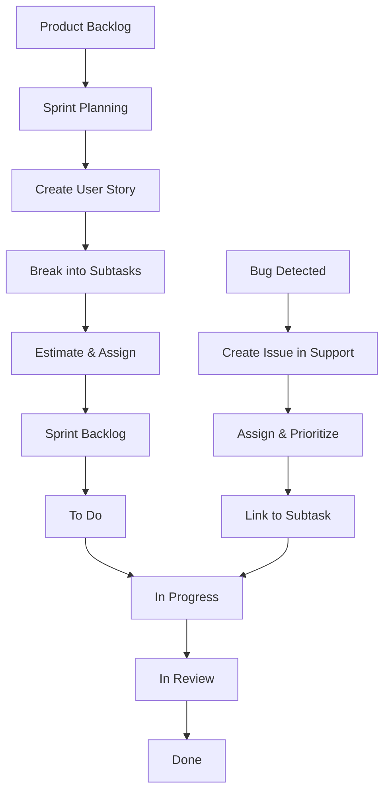

# Project Management & Workflow

This document outlines how our team manages tasks, tracks issues, and collaborates on the Track Hub 1 project.

## Overview

Our team uses **Jira** for task management with integration to **Clockify** for time tracking. We follow an adapted Scrum methodology with user stories, subtasks, and a support system for incident management.

## Table of Contents

- [User Story Workflow](#user-story-workflow)
- [Sprint Planning](#sprint-planning)
- [Issue Management](#issue-management)
- [Priority Levels](#priority-levels)
- [Time Tracking](#time-tracking)

---

## User Story Workflow

### 1. Creating User Stories

User stories are created in the **Product Backlog** following the standard format for open issues in the original fork. Normally, each story corresponds to a work item defined in the fork. However, new independent stories may arise, for which the following convention is used:

```
As a [role], I want [feature]...
```

**Example**:
```
As a developer, I want comprehensive CI and CD flows that facilitate integration between various members.
```

### 2. Breaking Down into Subtasks

Each user story is broken down into **atomic subtasks** organized by functionality (e.g., frontend, logic, integration, review).

**Subtask Description Format**:
- Keep it simple and natural (no strict template)
- The description in subtasks is not necessary if the title reflects the work to be done.
- Example: "Add curator search API endpoint"

### 3. Assignment and Estimation

**Estimation**:
- Each subtask is estimated on a **1-10 scale** based on team experience
- Stories are estimated using **bottom-up aggregation** from subtasks
- Estimation is collaborative across all team members

**Assignment**:
- Each story has a **primary owner** (usually the member with most work on it)
- Goal: All members participate across different modules and task types
- Subtasks can be assigned to different team members

### 4. Task Board Flow

Subtasks move through the following columns:

1. **To Do** → Task ready to start
2. **In Progress** → Actively being worked on
3. **In Review** → Awaiting code review
4. **Done** → Completed and merged

---

## Sprint Planning

### Sprint Structure

The project is divided into two sprints:

- **Sprint 0**: Initial setup and foundation (up to M2)
- **Sprint 1**: Feature development (up to M3)

> **Note**: Jira only shows Sprint 1 because completed Sprint 0 tasks automatically move to Sprint 1 backlog, reflecting the state of both sprints.

### Planned Tasks vs. Discovered Tasks

#### Planned Tasks (Pre-Sprint)
1. Created during sprint planning
2. Added to Sprint Backlog from Product Backlog
3. Divided into subtasks
4. Estimated and assigned as described above

#### Discovered Tasks (During Sprint)
1. Added directly to Sprint Backlog
2. Estimated by the person who identified the task
3. Usually assigned to the identifier
4. **Should fit into an existing user story as a subtask**
5. If unrelated to existing stories (e.g., fixes to original forked code), add to **"Todo lo Demás"** section

> **Note**: Task titles and descriptions in Jira must be in English. For development, branch names can be translated into Spanish if preferred.

---

## Issue Management

### Creating an Issue

When a bug or incident is detected:

1. **Access Support Portal**:
   - In Jira, click "Generar una Solicitud" (Generate Request)
   - Opens support tool page

2. **Submit Request**:
   - Click "Submit a request or incident"
   - Provide a one-line summary

3. **Document Using Template (Example bellow)**:

```markdown
1. Pasos para reproducir
   1. Navega al repositorio del proyecto
   2. Inicia sesión como John Doe
   3. Ve a "Explorar comunidades"
   4. Haz clic en una comunidad donde no seas curador (por ejemplo, "Modelos de Aprendizaje Automático")

2. Resultado esperado
   * El botón "Gestionar" no debería aparecer ya que no soy curador

3. Resultado actual
   * El botón "Gestionar" es visible y se puede hacer clic

4. Entorno
   * Versión: 2.1.1
   * Navegador: Brave/Mac
   * Fecha de detección: 24/11/2025

5. Información adicional
   * No aplica
```

### Processing Issues

**After creating an issue**:

1. **Assign** the issue (usually to the identifier)
2. **Set priority** (Highest, High, Medium, Low, Lowest)
3. **Respond immediately** to meet SLA (8-hour response time)
4. **Link to branch/subtask** that will resolve it
   - Can be linked to an existing development subtask if applicable

**Working on an issue**:

1. Move to **"In Progress"** when starting
2. Follow the branching strategy
3. Move to **"Done"** when resolved
4. **Send response to reporter** confirming resolution

### SLA (Service Level Agreement)

- **Response Time**: 8 hours by default
- **Best Practice**: Respond immediately after creating the issue to ensure SLA compliance

---

## Priority Levels

### Default Priorities

| Type | Default Priority | Notes |
|------|-----------------|-------|
| **User Stories (Work Items)** | High | Stories directly related to project work items |
| **User Stories (Independent)** | Medium | Stories not directly tied to core work items |
| **Issues** | Variable | Set by reporter based on estimated complexity |
| **Subtasks** | N/A | No priority (inherit from parent story) |

### Priority Usage

Priorities are **referential**, not mandatory:
- Help team members identify high-value tasks
- Guide decisions for maximum incremental value
- Do not grant significant advantages in workflow

---

## Time Tracking

### Clockify Integration

- **Tool**: Clockify is integrated with Jira
- **Requirement**: Activate timer when working on any task
- **Purpose**: Track team performance and effort distribution
- **Process**:
  1. Click timer icon on Jira task
  2. Timer starts automatically
  3. Stop when done or switching tasks

> **Important**: Always track time to maintain accurate sprint metrics

---

## Workflow Summary


